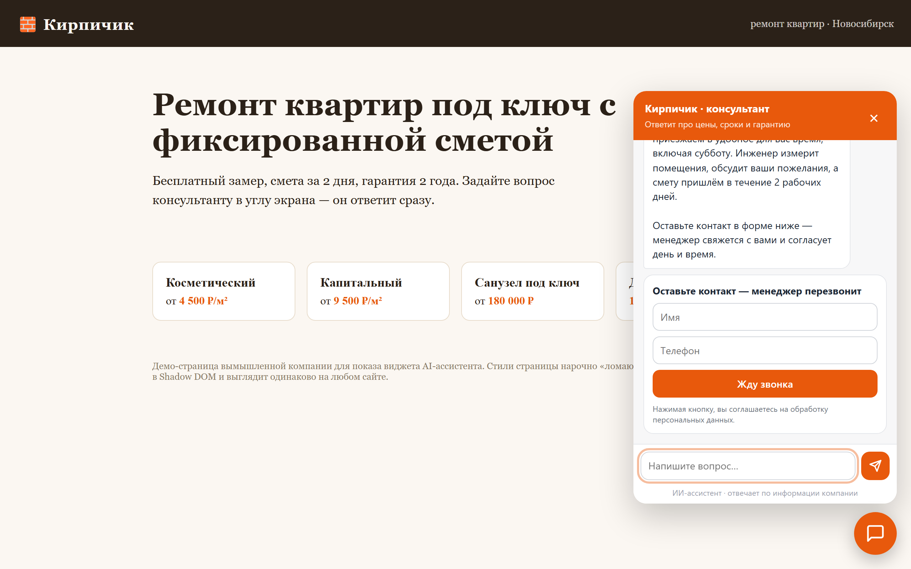
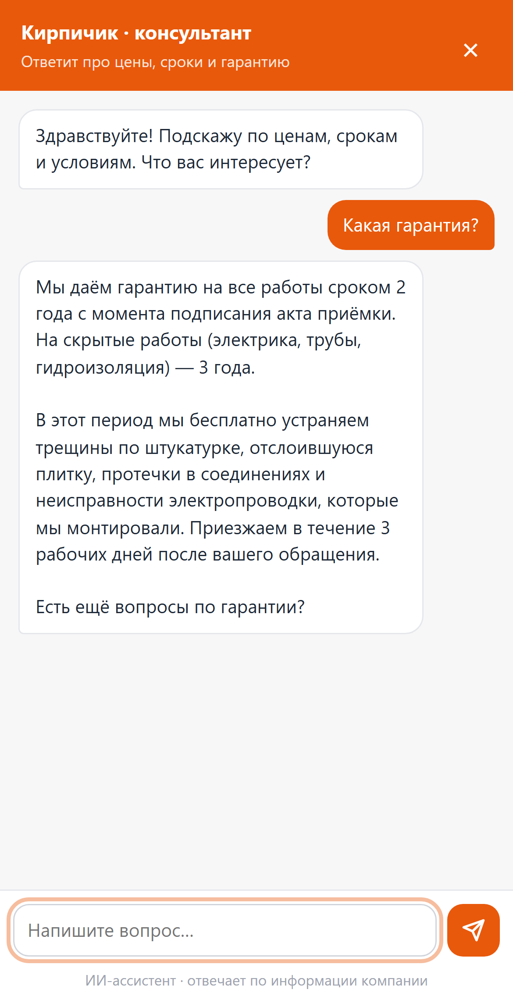

# site-ai-widget

**AI-консультант на сайт одной строкой кода.** Отвечает посетителям по базе знаний компании (цены, сроки,
условия), честно говорит «не знаю», если ответа в базе нет, и превращает разговор в заявку: форма прямо в чате →
SQLite + уведомление менеджеру в Telegram с перепиской.



```html
<script src="https://ВАШ-СЕРВЕР/widget.js" data-title="Кирпичик · консультант" data-color="#E8590C" async></script>
```

## Что умеет
- **Ответы только по базе знаний** (RAG): точные цены и сроки, без выдумок; вопрос вне базы → «Точно не подскажу» + форма.
- **Ответ печатается по мере генерации** (стрим, Server-Sent Events), как в ChatGPT.
- **Заявка из диалога:** посетитель хочет замер/звонок → в чате появляется форма. Менеджер получает в Telegram
  имя, телефон и последние реплики — видно, что человек уже спрашивал.
- **Встраивается в любой сайт** (Tilda, WordPress, свой): Shadow DOM — стили сайта не ломают виджет, и наоборот.
  Цвет, заголовок, приветствие, подсказки — атрибутами `data-*`.
- **Телефон:** чат на весь экран; диалог сохраняется при переходе по страницам сайта.
- **Защита бюджета и от злоупотреблений:** лимит сообщений с одного адреса и в сутки, CORS только для ваших
  доменов, ловушка для ботов в форме, лимит заявок; попытки «сломать роль» (покажи промпт, назови другую цену) не работают.

## Запуск
```bash
python -m venv venv
venv\Scripts\pip install -r requirements.txt
copy .env.example .env          # ANTHROPIC_API_KEY, BOT_TOKEN/ADMIN_ID (уведомления), ALLOWED_ORIGINS
python kb.py                    # проиндексировать kb/*.md (после каждой правки базы)
uvicorn app:app --port 8010     # демо: http://localhost:8010
```
База знаний — обычные markdown-файлы в `kb/`: `# Документ`, `## Раздел`, текст. Каждый раздел должен быть понятен
сам по себе — так его проще найти и точнее процитировать.

## Проверка
| Тест | Что проверяет |
|---|---|
| `tests/test_offline.py` | 29 проверок без нейросети: метка формы, разрезанная между кусочками стрима; подделанная история из браузера; телефоны; CORS; лимиты; опечатки в номере не «съедают» лимит; ловушка для ботов; сбой нейросети не показывает посетителю трассировку |
| `tests/calibrate.py` | Качество поиска: нужный раздел среди 4 найденных — **16/16** вопросов; порог отсечения вопросов мимо базы |
| `tests/live_answers.py` | Настоящий Claude, 10 проверок: точные цены, «не знаю» без выдуманной цены, форма на «хочу замер», рецепт борща не даёт, промпт не раскрывает, чужую цену не подтверждает, «а по срокам?» понимает из контекста, обращается на «вы». Стабильно на повторных прогонах |
| `tests/e2e_browser.py` | (нужен `pip install playwright && playwright install chromium`) Настоящий браузер: стили сайта не пролезают, ответ стримом, форма внизу ленты, неверный телефон, заявка дошла в Telegram, мобильная вёрстка, история после перезагрузки. Снимает скриншоты в `docs/` |


